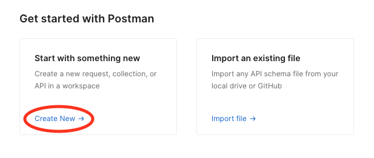
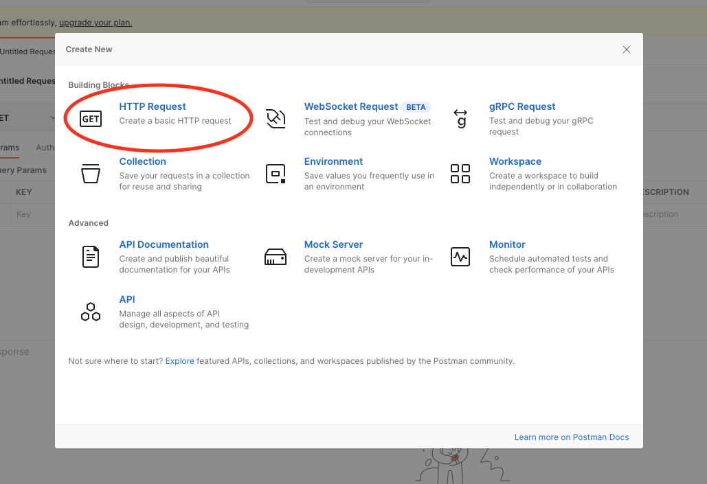
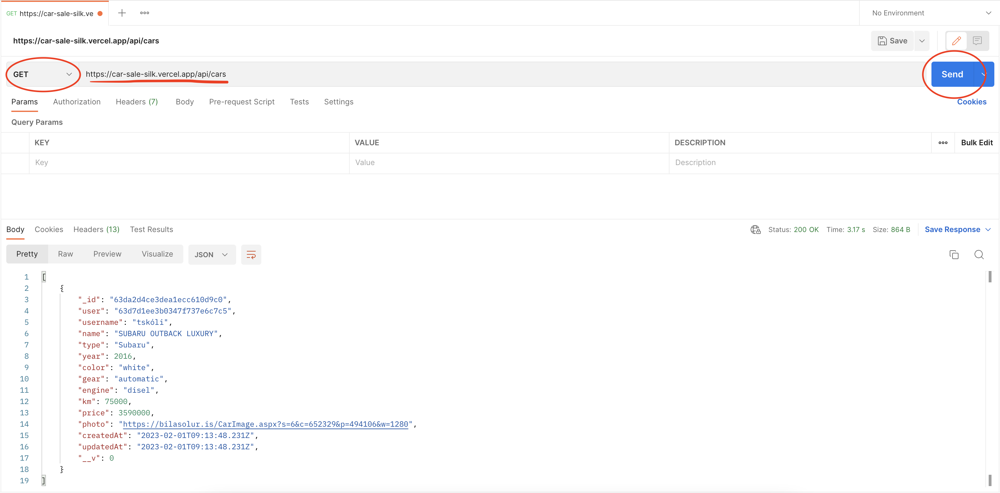
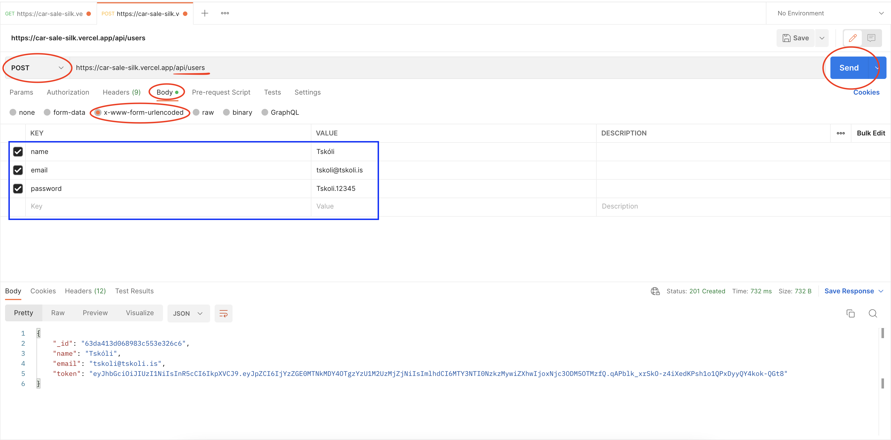
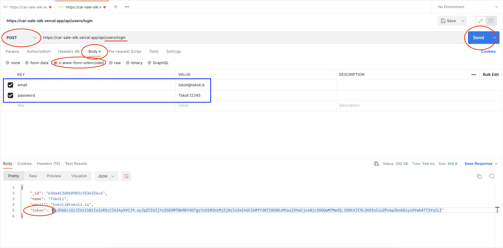
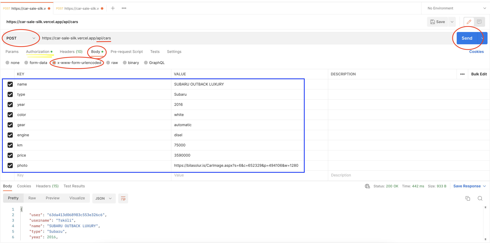
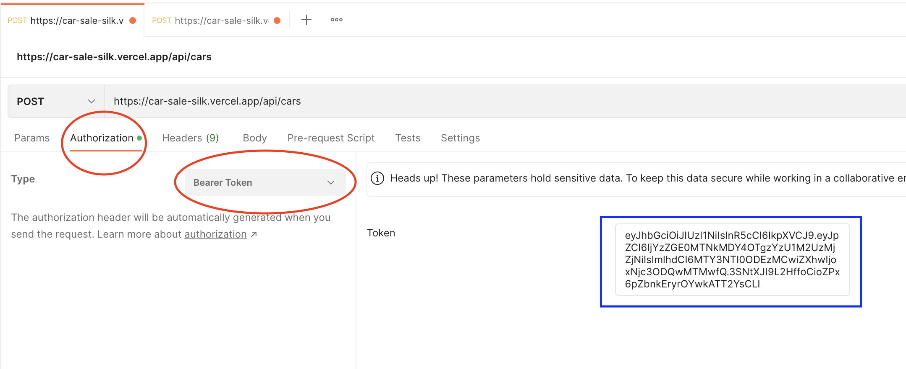
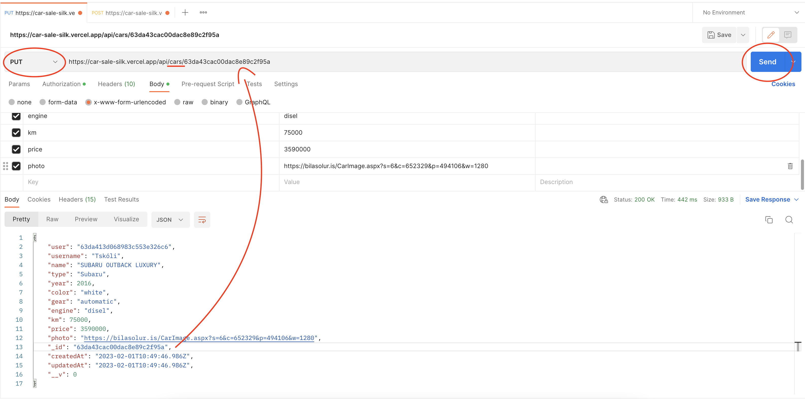
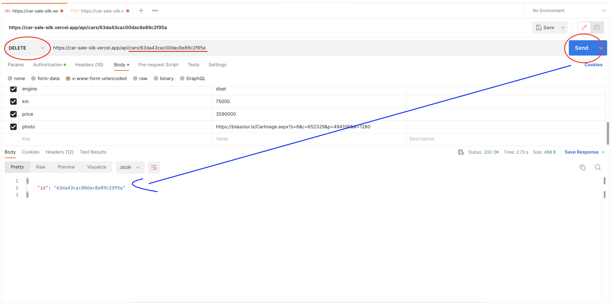
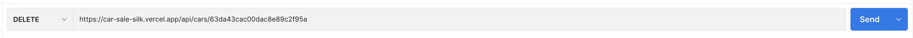

# Group Project 5 - CarSale :red_car:
1. [ About ](#about)
2. [ API Documentation ](#api)
3. [ Postman ](#postman)

## About
#### The App for this project focused mainly on the backend and error handling/defense mechanisms
##### It consists of a database about cars for sale.
##### After you create an account you can post, update and delete information about the car you wish to sell.
##### The user is the only one with authorisation to update and delete the information they post

## Postman
#### Click the button below and try out our API!

## API Documentation 

### STEP 1 - Open App
 #### 1. Open your Postman Desktop App.
 ##### 2. If you do not have the Desktop App visit https://www.postman.com/ and Sign up for free.
  When logged in you will need to locate where it says **Get started with Postman** and below choose **Start with something new**, Next select **HTTP Request**
  
  
  
### STEP 2 - CONNECTING TO THE SERVER VIA URL
 #### Enter the following url: https://car-sale-silk.vercel.app/api/cars

### STEP 3 - "GETTING" all the cars that have been created
 #### 1. Choose 'GET' from the dropdown list next to the url
 #### 2. Press Send Blue button next to the url
 #### :partying_face: Result: you should now see all of the cars that have been posted.  
 
 
### STEP 4 - CREATING A USER
 If you want to skip this part you can go straight to **step 5** with a premade username
 #### 1. Open a new window, enter the url again but remove cars and replace with **users** (https://car-sale-silk.vercel.app/api/users)
 #### 2. Choose 'POST' from the dropdown list next to the url
 #### 3. Below choose 'Body' and below that choose 'x-www-urlencoded'
 #### 4. Now we are able to post a new user but first we have to have some information.
 #### 5. Add the following to 'KEY':
  ##### :ballot_box_with_check: name
  ##### :ballot_box_with_check: email
  ##### :ballot_box_with_check: password
 #### 6. Now you are able to add a 'VALUE' to your key, example/ :ballot_box_with_check: name Tskoli
 #### 7. Press Send
 #### :partying_face: Result: you should now see your id, name, email and token.
 

### STEP 5 - LOGIN
 #### 1. Open a new window, enter the url again but add to the ending **login** https://car-sale-silk.vercel.app/api/users/login
 #### 2. Choose 'POST' in the dropdown menu next to the url.
 #### 3. Below choose 'Body' and below that choose 'x-www-urlencoded'
 #### 4. Now we are able to "login# but first we have to have some information.
 #### 5. Add the following to 'KEY':
  ##### :ballot_box_with_check: email
  ##### :ballot_box_with_check: password
 #### 6. Enter the email address and password you created before OR use the preexisting one here below 
 email: tskoli@tskoli.is 
 password: Tskoli.12345
 #### 7. Press Send
 #### :partying_face: Result: Congrats! you are now logged in as a user and are able to 'POST' a car if you can see your id, name, email and token.
 

### STEP 6 - POSTING A CAR
 #### 1. Go back to the cars tab
 #### 2. Choose 'POST' in the dropdown menu next to the url.
 #### 3. Below choose 'Body' and below that choose 'x-www-urlencoded'
 #### 4. Now we are able to add some information to our car listing.
 #### 5. Add the following to 'KEY':
  ##### :ballot_box_with_check: name
  ##### :ballot_box_with_check: type
  ##### :ballot_box_with_check: year
  ##### :ballot_box_with_check: color
  ##### :ballot_box_with_check: gear
  ##### :ballot_box_with_check: engine
  ##### :ballot_box_with_check: km
  ##### :ballot_box_with_check: price
  ##### :ballot_box_with_check: photo  
 #### 6. Now you are able to add a 'VALUE' to your key, example/ :ballot_box_with_check: name SUBARU
 

### STEP 6.1 - POSTING A CAR
 #### 1. To be able to 'POST' a car you need authorization. This is where we will need to go back to our login tab and copy the "token" information
 only copy the text inside the quotation marks "token": " **copy this text** "
 #### 2. Go back to your car tab and where we selected 'Body' before now we want to select 'Authorization'
 ##### 3. Next to **Type** select 'Bearer Token' from the dropdown menu
 ##### 4. Paste your Token in the input field.
 #### 5. Press Send
 #### :partying_face: Result: Congrats! you have now made your first 'POST' and should see the information displayed with your username.
  

### STEP 7 - UPDATING A CAR
make sure you are on the car ulr where you made a 'POST' before
 #### 1. Choose 'PUT' in the dropdown menu next to the url.
 #### 2. To be able to update you need authorization, this is where the **car id** comes in.
 #### 3. Locate the id from the 'GET' result only copy the text inside the quotation marks "_id": " **copy this number** "
 #### 4. Add the id to the url with a / symbol between
 #### 5. Now you are able to update a value
 #### 6. Press Send
 #### :partying_face: Result: The value you changed should be updated!
  

### STEP 8 - DELETING A CAR
make sure you are on the car ulr where you made a 'PUT' before
 #### 1. Choose 'DELETE' in the dropdown menu next to the url.
 #### 2. To be able to update you need authorization, this is where the **car id** comes in.
 #### 3. Locate the id from the 'GET' result
 #### 4. Add the id to the url with a / symbol between
 #### 5. Now you are able to delete the 'POST' that belongs to the id
 #### 6. Press Send
 #### :partying_face: Result: The post you made should now be replaced with only the id number and it should no longer be visable in the 'GET' results!
 remember to remove the id number from the url when you want to 'GET' cars
  
  

